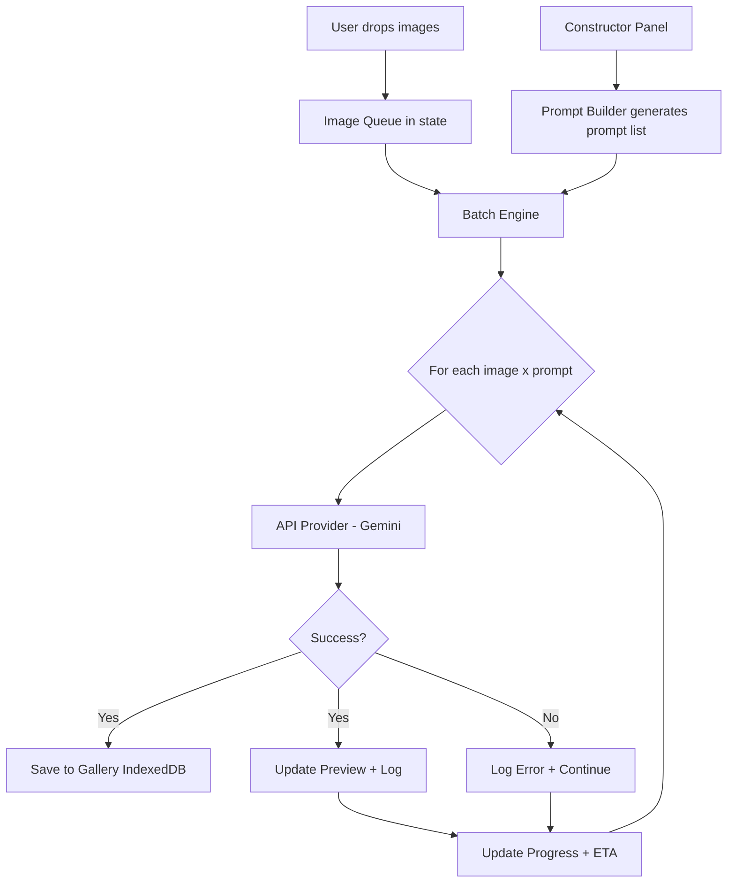

# Batch Generation Tab — Architecture Plan

## Overview

Port the Python Batch Generation tab to the web. Simplified model:
- **Images**: drag-and-drop or file picker (flat list, no subfolders)
- **Prompts**: generated from the Constructor (season × lighting matrix) — no external prompts.md
- **Engine**: Gemini API now, but architecture supports pluggable providers
- **Output**: results saved to IndexedDB Gallery + live preview during generation

---

## Data Flow



---

## Architecture — File Structure

```
nano-papl-web/src/
├── lib/
│   ├── batch/
│   │   ├── batch-engine.ts        # Core batch processing loop
│   │   ├── prompt-builder.ts      # Builds prompt list from ConstructorState
│   │   └── providers/
│   │       ├── types.ts           # ImageProvider interface
│   │       └── gemini-provider.ts # Gemini implementation
│   ├── gemini.ts                  # Existing — reused for chat
│   ├── image-db.ts                # Existing — gallery storage
│   └── storage.ts                 # Existing — add batch config persistence
├── components/
│   ├── batch/
│   │   ├── batch-page.tsx         # Main page orchestrator
│   │   ├── image-drop-zone.tsx    # Drag-and-drop + file picker
│   │   ├── batch-config.tsx       # Generation settings panel
│   │   ├── constructor-panel.tsx  # Extract from app-shell (already exists)
│   │   ├── monitoring-panel.tsx   # Log, progress, ETA, preview
│   │   └── image-compare.tsx      # Side-by-side input→output preview
│   └── layout/
│       └── app-shell.tsx          # Updated: BatchPage uses new components
```

---

## Key Interfaces

### ImageProvider (pluggable engine)

```typescript
interface GenerationResult {
  success: boolean;
  imageDataUrl?: string;    // base64 data URL
  error?: string;
  metadata?: {
    width: number;
    height: number;
    format: string;
  };
}

interface ImageProvider {
  name: string;
  generate(params: {
    prompt: string;
    inputImage: string;      // base64 data URL
    resolution: string;      // "1K" | "2K" | "4K"
    aspectRatio: string;     // "16:9" | "1:1" | etc.
  }): Promise<GenerationResult>;
  
  abort(): void;
}
```

This allows swapping Gemini for any future provider (fal.ai, Replicate, etc.) without touching the batch loop.

### PromptVariant (output of Constructor)

```typescript
interface PromptVariant {
  id: string;
  title: string;          // e.g. "Winter_Daylight"
  season: string;
  lighting: string;
  prompt: string;          // Full assembled prompt text
  hasXmas: boolean;
}
```

### BatchJob (runtime state)

```typescript
interface BatchTask {
  id: string;
  imageFile: File;
  promptVariant: PromptVariant;
  status: "pending" | "running" | "success" | "error";
  result?: GenerationResult;
  duration?: number;       // seconds
}

interface BatchState {
  status: "idle" | "running" | "paused" | "completed" | "stopped";
  tasks: BatchTask[];
  currentTaskIndex: number;
  startTime: number | null;
  stats: {
    completed: number;
    failed: number;
    total: number;
    avgDuration: number;
  };
}
```

---

## Component Breakdown

### 1. `batch-page.tsx` — Main Orchestrator

Two-column layout (like Python splitter):
- **Left**: Config (image drop zone, generation settings, constructor button)
- **Right**: Monitoring (preview, log, progress, controls)

State management: `useReducer` for `BatchState` — cleaner than multiple `useState` for complex async flows.

### 2. `image-drop-zone.tsx` — Image Input

- Drag-and-drop area with visual feedback
- Click to open file picker (`<input type="file" multiple accept="image/*">`)
- **NEW**: Also support `webkitdirectory` for folder selection (Chrome/Edge)
- Shows thumbnail grid of queued images
- Remove individual images or clear all
- Validates file types (png, jpg, webp)

### 3. `batch-config.tsx` — Generation Settings

- Resolution picker: 1K / 2K / 4K toggle
- Aspect Ratio dropdown (same list as chat)
- Output format: PNG / JPG / WebP toggle
- Save to Gallery checkbox (default: on)
- **NEW**: Concurrency selector (1 = sequential, 2-3 = parallel requests) — for future
- Engine selector (currently only Gemini, greyed out)

### 4. `constructor-panel.tsx` — Prompt Constructor

Already exists in app-shell as `ConstructorPanel`. Extract to separate component.
- Season × Lighting matrix
- Base prompt, atmosphere, lighting definitions
- Xmas toggle per cell
- **NEW**: Live prompt count badge showing total active variants
- **NEW**: "Preview Prompts" button — shows all assembled prompts before running

### 5. `monitoring-panel.tsx` — Live Monitoring

- **Image Compare**: side-by-side INPUT → OUTPUT (like Python `ModernImageCompare`)
- **Current Prompt**: read-only text showing what's being processed
- **Log Console**: monospace scrolling log area
- **Progress Bar**: with `completed / total` counter
- **ETA**: calculated from average duration
- **Controls**: START BATCH / STOP buttons

### 6. `prompt-builder.ts` — Prompt Assembly Logic

Takes `ConstructorState` and produces `PromptVariant[]`:

```
For each active season:
  For each active lighting in that season:
    prompt = basePrompt + seasonDesc + atmosphere + lightingDef + lightOverride + globalRules + camera
    if xmas: prompt += xmasSuffix
    yield { title: `${season}_${lighting}`, prompt, ... }
```

### 7. `batch-engine.ts` — Core Processing Loop

```typescript
async function* runBatch(
  images: File[],
  prompts: PromptVariant[],
  provider: ImageProvider,
  config: BatchConfig,
  signal: AbortSignal
): AsyncGenerator<BatchEvent> {
  // Yields events: "task-start", "task-complete", "task-error", "batch-complete"
  for (const image of images) {
    for (const prompt of prompts) {
      if (signal.aborted) return;
      yield { type: "task-start", imageFile, promptVariant };
      const result = await provider.generate({ ... });
      yield { type: result.success ? "task-complete" : "task-error", ... };
    }
  }
}
```

Uses `AsyncGenerator` pattern — clean, testable, and the consumer (React component) handles UI updates per event.

### 8. `gemini-provider.ts` — Gemini Implementation

Wraps existing `/api/gemini` route to conform to `ImageProvider` interface. Reuses the same proxy mechanism already in the app.

---

## New Features (Web Enhancements)

| Feature | Description |
|---------|-------------|
| **Prompt Preview** | Before starting, see all generated prompts in a modal — catch errors early |
| **Task Queue Visualization** | Grid/list showing all image×prompt combos with status badges |
| **Pause/Resume** | Pause batch mid-run, then continue from where it stopped |
| **Retry Failed** | One-click retry only the failed tasks |
| **Auto-save to Gallery** | Each successful result immediately saved to Gallery (IndexedDB) with metadata |
| **Batch Summary** | After completion, show stats: total time, success rate, avg per image |
| **Image Thumbnails** | Preview dropped images as a grid before starting |
| **Download All as ZIP** | After batch completes, download all results as a single ZIP file (using JSZip) |
| **Dark/Light drag feedback** | Theme-aware drop zone with animated borders |
| **Keyboard shortcuts** | Ctrl+Enter to start, Escape to stop |

---

## Additional Requirements (from review)

### Constructor Presets
- Every field in the Constructor is editable by the user
- "Reset to Defaults" button restores all fields to template values (already exists)
- **NEW: Save/Load Custom Presets**
  - User can save the current Constructor state as a named preset
  - Presets stored in localStorage (`nanopapl_constructor_presets`)
  - Dropdown to load a saved preset, overwriting current state
  - Delete presets
  - At least one "Default" preset that cannot be deleted

### Folder Drag-and-Drop
- Support dropping an **entire folder** onto the drop zone
- Uses `DataTransferItem.webkitGetAsEntry()` → `DirectoryReader` to recursively read folder contents
- **File validation**: only accept image files with extensions: `.jpg`, `.jpeg`, `.png`, `.webp`, `.gif`, `.bmp`
- Non-image files are **silently skipped** (no error, just ignored)
- Show a toast/log like "Loaded 12 images (3 non-image files skipped)" for transparency
- Also support dropping multiple individual image files
- Also support clicking to open file picker with `accept="image/*"`

---

## State Persistence

Using existing `storage.ts` pattern:
- `nanopapl_batch_config` — generation settings (resolution, ratio, format)
- `nanopapl_constructor_state` — full Constructor state (already complex, worth persisting)
- Batch results → IndexedDB Gallery (existing `saveGalleryItem`)

---

## Implementation Order

The work is split into layers: foundation → UI components → integration → polish.

1. **Foundation Layer** — lib utilities
   - `prompt-builder.ts` — prompt assembly from Constructor
   - `providers/types.ts` — ImageProvider interface
   - `providers/gemini-provider.ts` — Gemini implementation
   - `batch-engine.ts` — core async processing loop

2. **UI Components** — independent, testable
   - `image-drop-zone.tsx` — drag-drop + file picker + thumbnails
   - `image-compare.tsx` — side-by-side preview
   - `batch-config.tsx` — settings panel
   - `monitoring-panel.tsx` — log + progress + controls

3. **Integration** — wire everything together
   - Extract `ConstructorPanel` from app-shell to own file
   - Build `batch-page.tsx` orchestrator with `useReducer`
   - Connect to Gallery (save results)
   - State persistence (localStorage)

4. **Polish & New Features**
   - Prompt preview modal
   - Pause/Resume
   - Retry failed
   - Batch summary
   - Download ZIP
   - Keyboard shortcuts
