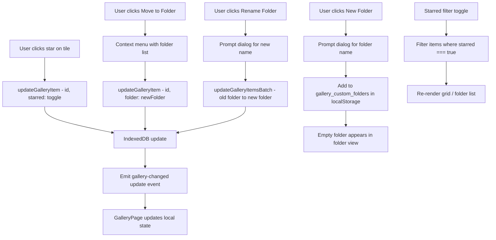

# Gallery Explorer & Favorites Plan

## Requirements

1. **Folder management** — Explorer-like experience: create folders, rename, delete, move images between folders
2. **Favorites/Star** — Star icon on each image; starred items can be filtered globally or per-folder

---

## Current State

[`GalleryItem`](nano-papl-web/src/lib/image-db.ts:17) already has `folder?: string`. Currently it's auto-set from the source image name during batch generation. The gallery UI already has folder view with collapsible sections.

What's missing:
- User-created folders (right now folders are derived from data, not managed)
- Move image to a different folder
- Rename / delete folders
- Favorites flag + filtering

---

## Data Model Changes

### `GalleryItem` — add `starred` field

```ts
// image-db.ts
export interface GalleryItem {
    id: string;
    dataUrl: string;
    prompt: string;
    source: "chat" | "batch";
    sessionId?: string;
    createdAt: number;
    folder?: string;      // already exists
    starred?: boolean;     // NEW — favorites flag
}
```

No DB version bump needed — `starred` is optional on existing records.

### New function: `updateGalleryItem`

We need a generic update function to modify `folder` and `starred` on existing items without re-writing the whole item:

```ts
// image-db.ts
export async function updateGalleryItem(
    id: string,
    updates: Partial<Pick<GalleryItem, "folder" | "starred" | "prompt">>
): Promise<void>
```

This reads the item, merges the updates, writes it back, and emits an "update" event.

### Extend `GalleryChangedDetail`

```ts
export interface GalleryChangedDetail {
    action: "add" | "delete" | "clear" | "update";  // add "update"
    item?: GalleryItem;
}
```

---

## Folder Management

### How folders work
- Folders are **just string values** on the `folder` field of `GalleryItem`
- The list of folders is computed from `items.map(i => i.folder).filter(Boolean)` — plus any explicitly created empty folders stored in localStorage as `gallery_custom_folders: string[]`
- This avoids a separate IndexedDB store for folder metadata

### Actions

| Action | Implementation |
|--------|---------------|
| **Create folder** | Button in toolbar opens a prompt dialog; folder name is saved to `gallery_custom_folders` in localStorage. Folder appears in sidebar/list even if empty. |
| **Rename folder** | Right-click or menu on folder header → prompt for new name → batch-update all items with old folder name to new name via `updateGalleryItem`. Also update `gallery_custom_folders`. |
| **Delete folder** | Right-click or menu → confirm → moves all items to root/ungrouped, removes folder from `gallery_custom_folders`. |
| **Move image to folder** | Context menu on image tile → submenu showing all available folders + "Ungrouped" → calls `updateGalleryItem(id, { folder: newFolder })`. |
| **Move to folder via drag** | NOT in v1 — adds complexity. Context menu is sufficient. |

### UX — Folder view enhancements

```
┌──────────────────────────────────────────────┐
│ [+ New Folder]  [Flat│Folders]  [S│M│L]      │
│ [★ Starred]                      [Clear All] │
├──────────────────────────────────────────────┤
│ ▼ building_exterior  (8) [⋮ Rename│Delete]   │
│   ┌──┐ ┌──┐ ┌──┐ ┌──┐ ┌──┐ ...             │
│   │★ │ │  │ │★ │ │  │ │  │                  │
│   └──┘ └──┘ └──┘ └──┘ └──┘                  │
│ ▶ park_scene  (4) [⋮]                        │
│ ▶ Ungrouped  (2)                             │
└──────────────────────────────────────────────┘
```

Each folder header has a `⋮` menu button with: Rename, Delete, Expand All / Collapse All.

---

## Favorites / Star System

### Star toggle
- Each image tile shows a **star icon** in the top-left corner
- Unfilled star = not starred, filled yellow star = starred
- Click toggles `starred` via `updateGalleryItem(id, { starred: !item.starred })`
- Star is always visible (not just on hover) for quick access

### Filtering
- Toolbar has a **★ Starred** toggle button
- When active, shows only items where `starred === true`
- Works in both Flat and Folder view modes
- In Folder view + Starred filter: folders with zero starred items are hidden

### Lightbox
- Star toggle also available in lightbox view

---

## Implementation Steps

### Step 1: Data layer — `image-db.ts`
- Add `starred?: boolean` to `GalleryItem`
- Add `"update"` to `GalleryChangedDetail.action`
- Add `updateGalleryItem()` function
- Add `updateGalleryItemsBatch()` for bulk folder rename

### Step 2: Gallery UI — `app-shell.tsx`
- Add state: `starredFilter`, `customFolders`
- Add toolbar: "New Folder" button, "★ Starred" filter toggle
- Star icon on each tile — always visible, click to toggle
- Context menu on each tile: "Move to folder" submenu
- Folder header: `⋮` menu with Rename / Delete
- Starred filter toggle in lightbox
- Persist `gallery_custom_folders` to localStorage

### Step 3: Context menu component
- Small dropdown positioned near the click point
- Reusable for both tile context menu and folder header menu
- Closes on outside click / Escape

---

## Files to Modify

| File | Changes |
|------|---------|
| [`image-db.ts`](nano-papl-web/src/lib/image-db.ts) | Add `starred`, `updateGalleryItem`, `updateGalleryItemsBatch`, extend event type |
| [`app-shell.tsx`](nano-papl-web/src/components/layout/app-shell.tsx) | Major GalleryPage update: folder CRUD, star toggle, context menus, filtering |

No new files needed — context menu can be inline in app-shell or a small helper component.

---

## Data Flow


