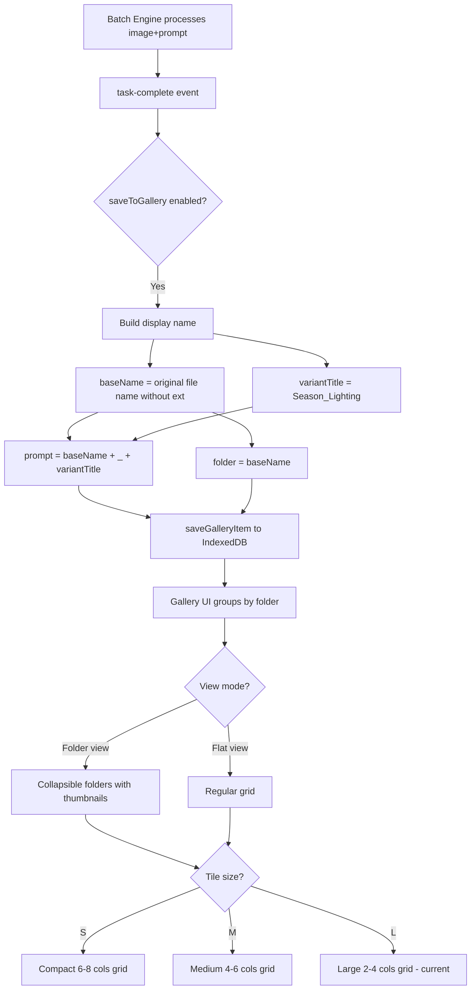

# Gallery Improvements Plan

## Current State Analysis

### Gallery (`GalleryPage` in `app-shell.tsx:709-868`)
- Flat grid of `GalleryItem`s — no folders or grouping
- Fixed tile size: `grid-cols-2 sm:grid-cols-3 lg:grid-cols-4` — always large
- Lightbox, download, delete actions per item

### GalleryItem (`image-db.ts:17-24`)
```ts
interface GalleryItem {
    id: string;
    dataUrl: string;
    prompt: string;          // Currently stores variant title like "Summer_Daylight"
    source: "chat" | "batch";
    sessionId?: string;
    createdAt: number;
}
```
- No `originalFileName` field
- No `folder` / grouping field

### Image naming on download (`app-shell.tsx:757`)
- Current: `gallery-${item.id.slice(0, 8)}.png` — meaningless UUID prefix
- No original image name anywhere in the chain

### Gallery save in batch (`batch-page.tsx:259-266`)
- Saves `prompt: event.task.promptVariant.title` which is e.g. `"Summer_Daylight"`
- No reference to the original input image filename

### Prompt variant title format (`prompt-builder.ts:101`)
- `${seasonName}_${lightName}_${Xmas?}` e.g. `"Winter_Night_Xmas"`

---

## Feature 1: Folders in Gallery

### Approach
Group gallery items by **original image name** — the most natural folder since one source image produces multiple season/lighting variants.

### Changes

**`image-db.ts`** — extend `GalleryItem` with a `folder` field:
```ts
interface GalleryItem {
    // ... existing fields
    folder?: string;  // Original image filename without extension
}
```
- IndexedDB schema version bump not needed — just a new optional field on existing store
- `loadGalleryItems()` stays the same; grouping is done in the UI layer

**`app-shell.tsx` GalleryPage** — add folder view:
- Group items by `item.folder` — items without folder go to "Ungrouped"
- Two view modes: **Folder view** (collapsed/expanded folders) and **Flat view** (current grid)
- Each folder shows: folder name, item count, thumbnail of first image
- Click folder to expand and see its images
- Toggle button in the toolbar: Folder view / Flat view

### Folder View UX
```
┌─────────────────────────────────────┐
│ [Folder View ▾]  [Size: M]  [Clear]│
├─────────────────────────────────────┤
│ ▼ building_exterior  (8 images)     │
│   ┌──┐ ┌──┐ ┌──┐ ┌──┐ ┌──┐ ...    │
│   └──┘ └──┘ └──┘ └──┘ └──┘        │
│ ▶ park_scene  (4 images)            │
│ ▶ city_street  (6 images)           │
└─────────────────────────────────────┘
```

---

## Feature 2: Toggle Tile Size Modes

### Approach
Three size presets switchable via a toolbar button: **S**, **M**, **L**.

| Mode | Grid columns | Info shown |
|------|-------------|------------|
| **S** (small) | `grid-cols-4 sm:grid-cols-6 lg:grid-cols-8` | Image only, name on hover |
| **M** (medium) | `grid-cols-3 sm:grid-cols-4 lg:grid-cols-6` | Image + truncated title |
| **L** (large) | `grid-cols-2 sm:grid-cols-3 lg:grid-cols-4` | Image + title + date + source badge — current layout |

### Changes

**`app-shell.tsx` GalleryPage**:
- Add state: `const [tileSize, setTileSize] = useState<"S" | "M" | "L">("L")`
- Persist preference to `localStorage` via `storage.set("gallery_tile_size", ...)`
- Toolbar: 3-segment toggle button [S | M | L]
- Grid class changes based on `tileSize`
- For "S" mode: hide the info section below image, show name tooltip on hover
- For "M" mode: show only truncated prompt text, no date/badge

---

## Feature 3: Generated Image Naming with Original Filename

### Current naming flow
1. Batch engine iterates: `for imageFile of images` → `for prompt of prompts`
2. On task-complete, saves to gallery with `prompt: event.task.promptVariant.title` (e.g. `"Summer_Daylight"`)
3. On download: `gallery-${uuid}.png`

### New naming pattern
```
{OriginalName}_{Season}_{Lighting}_{Xmas?}.png
```
Example: `building_exterior_Summer_Daylight.png`, `park_scene_Winter_Night_Xmas.png`

### Changes

**`batch-engine.ts`** — `BatchTaskInfo` already has `imageFile: File`, so `imageFile.name` is available.

**`batch-page.tsx`** — update the gallery save in `processBatchEvent`:
```ts
// Extract base name from original file
const baseName = event.task.imageFile.name.replace(/\.[^.]+$/, "");
const variantTitle = event.task.promptVariant.title; // e.g. "Summer_Daylight"
const displayName = `${baseName}_${variantTitle}`;

saveGalleryItem({
    id: crypto.randomUUID(),
    dataUrl: event.result.imageDataUrl,
    prompt: displayName,           // "building_exterior_Summer_Daylight"
    folder: baseName,              // "building_exterior" — for folder grouping
    source: "batch",
    createdAt: Date.now(),
});
```

**`app-shell.tsx`** — update download handler:
```ts
const handleDownload = (item: GalleryItem) => {
    const a = document.createElement("a");
    a.href = item.dataUrl;
    // Use the prompt as filename — it now contains the full descriptive name
    const safeName = item.prompt.replace(/[^a-zA-Z0-9_\-]/g, "_");
    a.download = `${safeName}.png`;
    a.click();
};
```

---

## Data Flow Diagram



---

## Files to Modify

| File | Changes |
|------|---------|
| [`image-db.ts`](nano-papl-web/src/lib/image-db.ts) | Add `folder?: string` to `GalleryItem` interface |
| [`batch-page.tsx`](nano-papl-web/src/components/batch/batch-page.tsx:259) | Update gallery save — build `displayName` and `folder` from `imageFile.name` + `promptVariant.title` |
| [`app-shell.tsx`](nano-papl-web/src/components/layout/app-shell.tsx:709) | Rewrite `GalleryPage`: add folder grouping, tile size toggle, fix download naming |

No new files needed. No DB migration required — the new `folder` field is optional on the existing object store.
