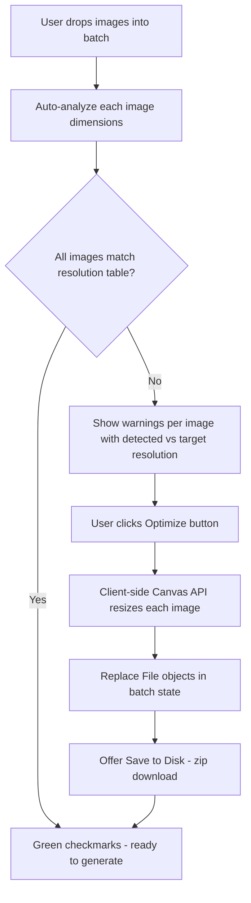
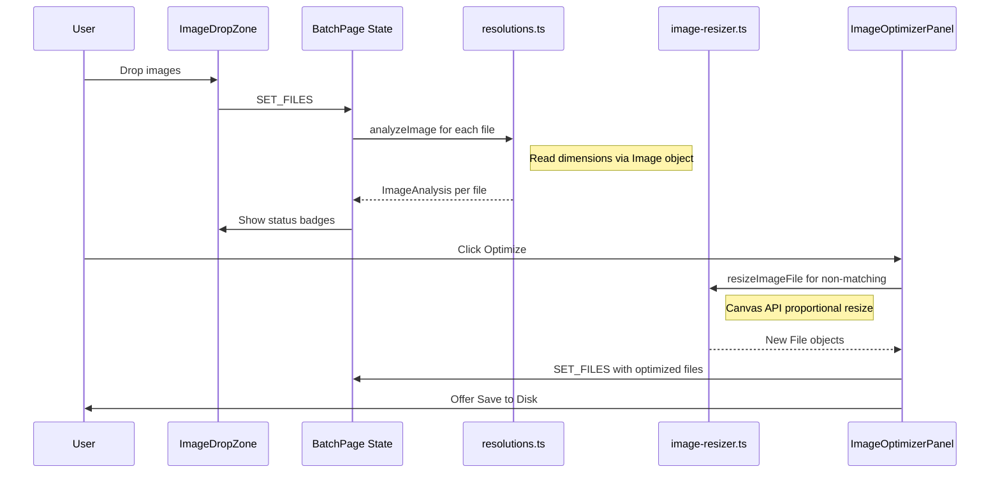

# Image Optimizer Integration Plan

## Problem

Nano Banana generation API produces better results when input images match specific empirically-verified resolutions. Images that don't match these resolutions risk getting cropped, distorted, or generating at unexpected aspect ratios. The desktop app has this as a separate Tools page; the web version needs it integrated into the Batch Generation workflow.

## Resolution Truth Table (from `core/config/resolutions.py`)

| Aspect Ratio | 1K | 2K | 4K |
|---|---|---|---|
| 1:1 | 1024x1024 | 2048x2048 | 4096x4096 |
| 16:9 | 1376x768 | 2752x1536 | 5504x3072 |
| 9:16 | 768x1376 | 1536x2752 | 3072x5504 |
| 4:3 | 1200x896 | 2400x1792 | 4800x3584 |
| 3:4 | 896x1200 | 1792x2400 | 3584x4800 |
| 3:2 | 1264x848 | 2528x1696 | 5056x3392 |
| 2:3 | 848x1264 | 1696x2528 | 3392x5056 |
| 5:4 | 1152x928 | 2304x1856 | 4608x3712 |
| 4:5 | 928x1152 | 1856x2304 | 3712x4608 |
| 21:9 | 1584x672 | 3168x1344 | 6336x2688 |

## Architecture

### User Flow



### Aspect Ratio Detection Algorithm

1. Read image dimensions via `Image` object or `createImageBitmap`
2. Calculate actual ratio = width / height
3. Compare against all known ratios from the table
4. Pick the closest match using minimum absolute difference
5. Look up the target dimensions for that aspect ratio at the selected resolution tier

### File Structure - New and Modified Files

```
nano-papl-web/src/lib/
  resolutions.ts              # NEW - Resolution table + aspect ratio detection
  image-resizer.ts            # NEW - Canvas-based resize service

nano-papl-web/src/components/batch/
  image-optimizer-panel.tsx   # NEW - Optimizer UI overlay
  image-drop-zone.tsx         # MODIFIED - Add resolution status badges per thumbnail
  batch-page.tsx              # MODIFIED - Add optimizer button + state
```

### 1. `resolutions.ts` — Resolution Table and Detection

Ports `RESOLUTION_TABLE` from Python to TypeScript. Key exports:

- `RESOLUTION_TABLE`: Record mapping aspect ratio string to tier dimensions
- `detectClosestAspectRatio(width, height)`: Returns the closest matching aspect ratio string
- `getTargetDimensions(aspectRatio, tier)`: Lookup target width/height
- `analyzeImage(width, height, tier)`: Returns analysis object with match status, detected ratio, target dimensions, and whether resize is needed

### 2. `image-resizer.ts` — Client-Side Resize Service

Uses the Canvas API for high-quality image resizing entirely in the browser:

- `resizeImageFile(file, targetWidth, targetHeight)`: Takes a `File`, returns a new `File` with resized content
- Uses `OffscreenCanvas` where available, falls back to regular `Canvas`
- Preserves original format (JPEG quality 95, PNG, WebP quality 95)
- Proportional scaling — same algorithm as `ImageResizerService.calculate_proportional_size`: uses the smaller ratio so image fits within bounds without upscaling

### 3. `image-optimizer-panel.tsx` — Optimizer UI

A panel/overlay accessible from the batch page left sidebar. Shows:

- **Per-image status table**: filename, current dimensions, detected aspect ratio, target dimensions, status icon (checkmark/warning)
- **Summary**: "X of Y images need optimization"
- **Optimize All button**: processes all non-matching images
- **Progress indicator** during optimization
- **Save to Disk button**: downloads optimized images as individual files or a zip
- After optimization, auto-replaces the `File` objects in batch state so the user doesn't need to re-upload

### 4. Changes to `image-drop-zone.tsx`

- After files are added, run `analyzeImage` on each to get dimensions
- Show small colored badge on each thumbnail: green dot = matches, yellow dot = needs resize
- This analysis happens asynchronously in the background

### 5. Changes to `batch-page.tsx`

- Add new state fields: `imageAnalysis: Map<string, ImageAnalysis>`, `optimizerOpen: boolean`
- Add an "Optimize Images" button in the left panel, below the image drop zone
- Button shows count of images needing optimization
- Opens the optimizer panel as an overlay, similar to how Constructor panel works
- After optimization completes, dispatch `SET_FILES` with the new resized `File` objects

### Data Flow



### Key Design Decisions

1. **Client-side only**: No server-side processing needed. Canvas API handles all resizing in the browser. This keeps the app fully static/client-side.

2. **No separate tab**: Lives inside batch generation as a button that opens an overlay panel, consistent with how Constructor panel already works.

3. **Auto-analysis on upload**: As soon as images are dropped, they get analyzed in the background. The user sees immediate feedback without clicking anything.

4. **Resolution tier from batch config**: The selected tier in batch config determines target dimensions. If user changes tier, re-analysis runs automatically.

5. **Save to disk**: After optimization, user can download the resized images. This lets them reuse optimized images across multiple generation sessions without re-optimizing.

6. **Auto-replace in input**: After optimization, the batch state `files` array is updated with the new resized `File` objects, so the user can immediately proceed to generation.

### Implementation Order

1. Create `resolutions.ts` with the resolution table and detection functions
2. Create `image-resizer.ts` with Canvas-based resize
3. Create `image-optimizer-panel.tsx` UI component
4. Modify `image-drop-zone.tsx` to show resolution status badges
5. Modify `batch-page.tsx` to add optimizer state, button, and wiring
6. Add save-to-disk functionality
